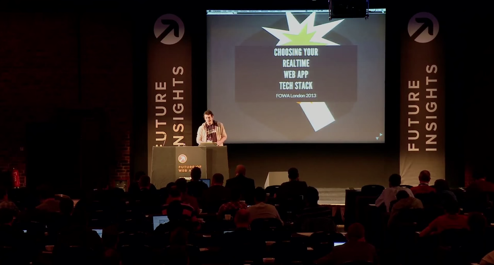

name: dblue

class: bg-dark-blue, center, middle
layout: true

<span class="twitter_id">@leggetter</span>

---

name: green

class: green-template, center, middle
layout: true

<span class="twitter_id">@leggetter</span>

---

name: lblue
layout: true

class: bg-light, center, middle

<span class="twitter_id">@leggetter</span>

---

name: white
layout: true

class: bg-white, center, middle, black-text
layout: true

<span class="twitter_id">@leggetter</span>

---

template: lblue
class: title

# Tools, Tips and Techniques<br />for <span style="text-decoration: underline;">Developing</span> Real-time Apps

* <span class="speaker">Phil @leggetter</span>
* <span class="speaker-job-title">Head of Developer Relations</span>
* <span class="speaker-pusher-logo"></span>

???

---

template: lblue
class: bg-contain circles
background-image: url(./img/pusher-circles.png)

---

template: white
class: top black-text

## What we'll cover

1. Why Real-Time?
--

background-image: url(https://docs.google.com/drawings/d/1DxIqk4b1LhBadH_O277Vr3wHEBOD8ERZPuO7WNqaFKM/pub?w=1195&h=721)

2. Tools, Tips & Techniques

???

* Firstly, apps don't have to have a UI
* Even so, if you are interested in UI considerations then there are lots of great resources on this from browser and mobile vendors.

---

template: dblue
class: bg-dark-blue, h1-big

# Why Realtime?

???

* Here are some examples of apps...

---

template: dblue
class: em-text, bg-cover, trans-h, bottom
background-image: url(./img/itv-news-may-2014.png)

# Notifications & Signalling

???

* Something has happened
* Changed
* Alert - do something

---

class: bg-cover, em-text, trans-h, bottom
background-image: url(./img/delighted-app.gif)

# Activity Streams

???

* a stream of activity
* things have - and are - happening
* synonymous with social apps
  * Twitter
  * Facebook
  * Google+
  * News
  * Sports

---

template: dblue

class: bg-cover, em-text, trans-h, bg-white, bottom
background-image: url(./img/senate-election-results.png)

# Data Visualizations

---

template: lblue
class: bg-video, bg-cover, trans-h, em-text, bottom

# Chat

<video id="video" autoplay="true" loop="true">
  <source src="./img/pie.webm" type="video/webm">
  <source src="./img/pie.mp4" type="video/mp4">
</video>

???

* The 101 of realtime
* An interactive experience
* Real-time matters

---

class: bg-white
background-image: url(./img/messaging-apps.png)

---

template: dblue
class: trans-h, bg-cover, bottom
background-image: url(./img/uber.jpg)

# Real-Time Location Tracking

---

template: lblue
class: trans-h, bottom
background-image: url(./img/atom-pair.gif)

# Multi-User Collaboration

???

* Google Apps
* Cloud 9
* TODO: other

---

template: lblue
class: bg-cover, trans-h, bg-white
background-image: url(./img/lunar-landing.png)

<h3 style="position: absolute; top: 2%; right: 2%; display: inline-block";>
  Multiplayer Games / Art
</h3>

---

background-image: url(./img/robot-door-fail.gif)
class: trans-h bottom bg-cover

# IoT

---

class: bg-pink, top

# <span class="tip-label"></span> Users expect a real-time UX

--


--

# Without a real-time UX your app appears broken

---

template: dblue
class: h1-big

# Tools, Tips and Techniques for Developing Real-time Apps

---

class: bg-white top black-text
background-image: url(https://docs.google.com/drawings/d/1_78n6-fvY8-iacXDtzfRlz0d-m57Ahz6P2DoKkJs_K4/pub?w=1195&h=721)

## The Anatomy of a Real-Time App

???

Whilst there's not one true anantomy for a real-time application the majorify of these applications consist of sources of data, maybe from database or 3rd party APIs, one or more applications servers glue all other components together, a real-time framework to deal with your real-time data delivery and functionality, and clients that interact with the real-time framework, and potentially the application server.

---

template: dblue
class: h1-big

# Where does real-time data come from?

---

class: fixed-width-list bg-pink top

## <span class="tip-label"></span> You Have Real-Time Data

--

Any event in your web stack...

* Incoming Data
* System Interactions
* User Interactions
* Data Changes

... represents real-time data.

???

---

class: bg-white
background-image: url(https://docs.google.com/drawings/d/1dL5nNi8l_tjGSKXPCrCfKljMOUmeC8HKU81LrY1x0wU/pub?w=1195&h=721)

???

Other systems that ultimately interact with with your application server. Databases, message queues, 3rd party services and anything that interacts with web endpoints that your application server exposes.

---

class: bg-white
background-image: url(https://docs.google.com/drawings/d/18g94RT1gHtORhiqTZon8j9U_TFtvto0SJJ9SfYejG6g/pub?w=1195&h=721)

???

This is open for debate.

But generally, the application server won't be the source of the real-time data - the real-time events. But it will be the organ within your living breathing real-time system that orchestrates the dataflow between the components.

---

class: bg-white
background-image: url(https://docs.google.com/drawings/d/15fczP5XSDf2uhK43TPgTNYnO2vJDcqFwFwREvgytmUQ/pub?w=1195&h=721)

???

Your real-time framework is all about real-time data.
* It handles incoming and outgoing data.
* e.g. connections, subscriptions to data, data synchronisation events, over-the-wire method and function calls
* Use case specific events e.g. user presence events (online/offline) or events for chat functionality
* It will also likely provide access to a number of events specific
to the functionality it offers

---

class: bg-white
background-image: url(https://docs.google.com/drawings/d/1rZmX1utBDUNEigmUWrr6WsupuNFoqjSR9jXnEgKjUmQ/pub?w=1195&h=721)

???

Each interaction with the application from the user is a real-time event with associated real-time data. Which of those events is important and should be acted upon depends on your application requirements.

---

class: bg-white black-text top
background-image: url(https://docs.google.com/drawings/d/144h2Lr-x5CAr7v1fqrV0MwHM77Mr5tAHtmpftBJ5j4I/pub?w=1195&h=721)

## Tools, Tips & Techniques - from left to right

???

Now that we've truely set the scene, let's make our way through the components in this real-time application and identify the tools, tips & techniques that I've found are really useful as we develop our app.

---

class: bg-pink tip top h1-big

# Before we begin...
--

## <span class="tip-label"></span> When designing & building real-time apps, always think about **how** the **decisions** you're making - **anywhere** in your stack - will **impact** the **client app**.

???

---

template: dblue
class: h1-big

# Data Sources

---

class: bg-white black-text top
background-image: url(https://docs.google.com/drawings/d/1lWV_UBvVoNWgO3u--0L5A6U2YSGSnaLPO_IC6YPF9uU/pub?w=1195&h=721)

## Consuming Data Sources

???

When building real-time applications you quite frequently get data from 3rd party components.

* APIs/Services
* Databases
* Queues

There are a lot of potential places where this real-time data can comes from.

---

class: bg-white fixed-width-list trans-h em-text top
background-image: url(img/apps-with-realtime-apis.png)

???

Not only are there lots of options, but they also deliver it in various forms.

--

# Code Callbacks

--

# WebHooks
--

# HTTP Streaming
--

# WebSocket

---

class: bg-video, trans-h, em-text, bottom
play_video:

## Example: The Twitter Streaming API<br /><small>Waiting for data...</small>

<video loop="true">
  <source src="./img/twitter-where-is-the-data.mp4" type="video/mp4">
</video>

---

class: bg-video, trans-h, em-text, bottom
play_video:

## Example: The Twitter Streaming API<br /><small>Sometimes there's just too much...</small>

<video loop="true">
  <source src="./img/twitter-lots-of-data.mp4" type="video/mp4">
</video>

---

class: top larger

## Problem:

You can't always control what the data source sends and when it sends it. Even it you can, it can be tedious to trigger test data.

With REST APIs we can generate fake data. With real-time... ?

--

## Solution:

Capture & replay

???

The problem: makes the development phase really difficult.

---

template: white
class: top
background-image: url(https://docs.google.com/drawings/d/1l-zpXT0rmra_oAmUJmO7dYiwAebHfUhJ3JTnWrt-fXM/pub?w=1195&h=721)

## Capture & Replay via Proxies

???

In production, you can capture this data. But in development you want a simple solution that requires less infrastructure.

---

class: top fixed-width-list

## WebHook Tools

???

WebHooks are HTTP callbacks from one server to another. They're triggered when one server has data that it wants to send to another, normally via a `POST` request.

--

Lots of options available

* [Forward](https://forwardhq.com/)
* [Finch](https://meetfinch.com/)
* [UltraHook](http://www.ultrahook.com/)
* [localtunnel.me](http://localtunnel.me/)
* [pagekite](https://pagekite.net/)
--

* [ngrok](https://ngrok.com/) -- *use ngrok*

---

class: bg-pink bg-video bg-cover trans-h em-text bottom

## <span class="tip-label"></span> Use ngrok

<video controls>
  <source src="./img/ngrok.mp4" type="video/mp4">
</video>

--
play_video:

---

template: white

## WebSocket / HTTP Streaming Tools

???

HTTP Streaming and WebSocket connections are persistent connections that potentially provide a constant stream of data from the data source.

---

class: fixed-width-list
template: white

## Proxies

* [Charles Proxy](http://www.charlesproxy.com/)
* [zaproxy](https://github.com/zaproxy/zaproxy)
* [Fiddler (Windows/.NET)](http://www.telerik.com/fiddler)

---

template: white
class: black-text

## GOR


* A simple http traffic replication tool written in Go.  
* [No WebSocket support right now](https://github.com/buger/gor/issues/2)

[github.com/buger/gor](https://github.com/buger/gor)

---

class: bg-white top black-text
background-image: url(https://docs.google.com/drawings/d/1-UKjjtf66kuYihycIQSXFiIIeyYVCYB36-6uppx3KS4/pub?w=1195&h=721)

## WebSocket / HTTP Streaming Tools<br /><small>Just write log files</small>

---

class: bg-white trans-h
background-image: url(./img/log-all-the-things.png)

<h2 style="position: absolute; top: 0; left: 0; display: inline-block;"><span class="tip-label"></span></h2>

---

class: fixed-width-list

## Logs

* Monitor them
* Filter them
* Build tools around them
* Replay them

---

class: bg-video, bg-cover, trans-h, em-text, bottom

# Logging Tools

<video id="video" autoplay="true" loop="true">
  <!-- <source src="./img/librato.webm" type="video/webm"> -->
  <source src="./img/librato-web.mp4" type="video/mp4">
</video>

???

There are some amazing logging tools out there.

* librato
* data dog
* loggly
* logstash

But they do too much. For this, we need something simple.

---

You could...

> log to stdout, use the [logfmt](https://brandur.org/logfmt) format, know your good old grep / sed / awk *- [@zimbatm](https://twitter.com/zimbatm)*

But I want there to be better options

---

class: bg-green thought

## **We need better HTTP Streaming/WebSocket capture & replay tooling to improve the developer experience**

???

We could do with simpler capture/replay tools


---

## It's all fine and well saying to capture & replay the data. But...

## You said, **always think about the client**! What about the client?

---

class: bg-pink

## <span class="tip-label"></span> **The server is your real-time work-horse**. It should still do the vast majority of data processing and decision making. Web, Mobile an IoT clients are great, but they're not processing machines.

???
Don't just pass all this data directly on to the client.

---

template: dblue
class: h1-big

# App Servers

---

## Processing

* Queries
* Transformations
* Data formatting

???

What other processing? What about IDML (DataSift)?

---

## Data Payload

<pre style="height: 80%; overflow: auto;">
<code class="json hljs remark-code" data-contents="./assets/tweet.json">
</code></pre>

???

Here's what a standard tweet JSON looks like. Do I really want to send all this over the wire? It ultimately has to be converted from bytes or a string and parsed into a an object before the client can do anything with it. The larger it is the more work the client has to do.

---

class: bg-pink

## <span class="tip-label"></span> Only send the data that is required

.left[
**Don't send this**
<pre>
<code class="json hljs remark-code" data-contents="./assets/tweet.json">
</code></pre>
]
.right[
**When you only need this**
```json
{
  "screen_name": "leggetter",
  "text": "I love to tweet",
  "created_at": "Wed Sep 23 18:10:25 +0000 2015"
}
```
]

???

Once you've applied the queries or transformations you should only send the data to the client that it needs and is going to use.

---

class: top bg-pink

## <span class="tip-label"></span> Send an initial image, then changes

* Maintain an image of the current state of data
* Only send data that changes

--

.left[
```json
{
  "home_team": "Liverpool",
  "home_team_score": 0,
  "away_team": "Arsenal",
  "away_team_score": 0,
  "event_time": "1443117125014"
}
```
]
--

.right[
```json
{
  "home_team": "Liverpool",
  **"home_team_score": 1,**
  "away_team": "Arsenal",
  "away_team_score": 0,
  **"event_time": "1443117150287"**
}
```
]
--
&#9660;
--

class: center-pre

.center[
```json
{
  "home_team_score": 1,
  "event_time": "1443117150287"
}
```
]

---

class: bg-video, trans-h, em-text, top
play_video:

## Example: Streaming Tweets to a UI<br /><small>Non-Existent-UX</small>

<video loop="true">
  <source src="./img/streaming-tweets-in-ui.mp4" type="video/mp4">
</video>

???

Even if you've made sure you're:
1. Doing all the heaving lifting on the server
2. only sending the data that's required
You still need to watch how often you're sending

---

class: bg-pink

## <span class="tip-label"></span> Control the frequency of updates

* 100ms is instantaneous to a human
* 250ms is average human reaction time
* Each update requires some processing
  * Data parsing
  * UI updates
  * ...
* Consider batching
  
---

template: dblue
class: h1-big

# Real-Time Framework

---

class: top
background-image: url(https://docs.google.com/drawings/d/1ERZ2boQXQ8PHFF738ZwCupymA7fSKzr8xIjW4SHlJdM/pub?w=1195&h=721)

## We know what data we're sending to the Real-Time Framework

???

So, we've covered building up the data payloads that we're going to send to the Real-Time Server...

---

class: bottom
background-image: url(https://docs.google.com/drawings/d/1k_7-4yTvs-cb6slQXvzgBwBL0SaFfE-hSpTjAfnS8Xg/pub?w=1195&h=721)

* Can we confirm what's going in?
* And see what's going out?

---

class: fixed-width-list bg-pink

## <span class="tip-label"></span> You need to know what's going on in your real-time framework

* connections
* subscriptions
* messages
* presence
* other events/features

???

As you're developing you really want to know if the code you are writing is having the desired effect. Are connections being established, are subscriptions to data being made, are messages going in to your real-time framework and going out the other side to connected clients?

Is the framework supported functionality working as expected?

---

class: fixed-width-list

## LOG ALL THE THINGS

* Monitor them
* Filter them
* Build tools around them

---

class: bg-video, trans-h, em-text, bottom

## Example: Pusher Debug Console

<video loop="true">
  <source src="./img/pusher-debug-console.mp4" type="video/mp4">
  <source src="./img/pusher-debug-console.webm" type="video/webm">
</video>

--

play_video:

---

## Again: Capture & Replay

---

class: bg-green thought

## **Did I already mention that we need better tools for this?**

???

**TODO: reach out to @zimbatm & @hpoom about real-time logging solutions**

---

class: top
background-image:url(https://docs.google.com/drawings/d/1KAb6UWTyOVCWMpf5ZOJHq4eW1nNSBcjnUrDTf0mw7Tw/pub?w=1195&h=721)

## Connectivity

---

class: bg-pink top

## <span class="tip-label"></span> Soon you won't be able to go to the bathroom<small><sup>†</sup></small> without SSL. So **use SSL all the time** - <span class="underline">including in development</span>.

<small><sup>†</sup> erm, I mean use HTTP/2 or ServiceWorker or any future web tech</small>

--

## You need SSL for networks with proxies and firewalls. In particular, mobile networks.

---

class: trans-h top
background-image: url(./img/internet-http-es-ws.png)

<h3 style="position: absolute; top: 0; left: 0; width: 100%; padding: 20px 0;"><span class="tip-label"></span> Use the most appropriate transport for your client</h3>

---

class: trans-h
background-image: url(./img/internet-http-es-ws-msg-pubsub-rmi-ds.png)

<h3 style="position: absolute; top: 0; left: 0; width: 100%; padding: 20px 0;"><span class="tip-label"></span> Use the right real-time comms pattern for your app</h3>

???

communication patterns on top of transports diagram

---

background-image: url(./img/rtw-tech-decision-matrix-black.png)
class: bg-white

---

background-image: url(./img/rtw-tech-decision-matrix-black.png)
class: bg-white

**TODO: use cases**

---

<a href="https://www.youtube.com/watch?v=VENVNimklWg"></a>
FOWA London 2013

---

template: dblue
class: h1-big

# Client Apps

---

class: top-left
background-image: url(https://docs.google.com/drawings/d/1rOpWrX-4xOoCmXDVuIZI50EKjRPWlIrFtcmYSJfoPuc/pub?w=1195&h=721)

## Client Apps (Breakdown)

---

class: top-left
background-image: url(https://docs.google.com/drawings/d/1N6NRRYf_qzDgkpPTmrK5D4F-fttyPwvw0NMs3o8ls3o/pub?w=1195&h=721)

## Client Apps (Breakdown)

---

class: fixed-width-list top

## Because we've **always considered the client** we're doing everything we can to make things easy

--

* Processing - on the server
* Payload - focused & minimal
* Image + Changes
* Formatted - further reduce processing
* Update frequency - controlled / batched

---

class: bg-pink

## <span class="tip-label"></span> **Monitor Client Performance** - if you know how the client is coping, you can make adjustments.

---

class: fixed-width-list

## Latency

* Timestamp published messages
* Check time upon receipt
* Consider:
  * Timezone differences
  * System clock offsets
* If latency gets high, inform the user

---

## Message Backlog

**TODO: diagram**

---

class: fixed-width-list

## Throttle Updates

**Let the server know the client is struggling**

## RESET

**If things get really bad**

---

class: top-left
background-image: url(https://docs.google.com/drawings/d/1nKhiqmidFMSJuVrWnBYKoLS4UWKsx7HHTzrMbuy-__I/pub?w=1195&h=721)

## Using the Real-Time Framework library within your App Logic

???

The point of integration between the real-time tech and your application.

---

class: fixed-width-list

## We've covered a lot

* Data Sources - you can't control the data
* Data considerations: processing, payload, update frequency
* Connectivity - SSL, transports & protocols
* Monitoring client performance

---

## **Problem:** All these things to consider and I just want to build a real-time feature!

---

**TODO: picture of Ben's FOWA London 2015 talk**

How did Ben build this?

???

Now, I'm sure Ben has lots of friends. But do you think he has them round his house for hours on end to help him make sure his demos work?

No!

---

class: bg-pink

## <span class="tip-label"></span> Use a service/library abstraction or stub. Mock out **data** (messages) & **connectivity** events.

---

class: fixed-width-list

## Use a service/library abstraction

* Angular Services
* Ember Services
* Write your own

---

## Write your own fake service implementations

**TODO: example**

---

## Bonus: **Abstractions enable change**. You could swap out the underlying real-time technology in the future.

---

background-image: url(https://docs.google.com/drawings/d/1S8HlwfMF7iMyoFQhx9YBmVeU3ebyJmjpIPJe9qiSlSk/pub?w=1195&h=721)

---

class: fixed-width-list

## You've done the hard work!

* Data:
  * Small payloads
  * Minimal processing
  * Easy to fake
* Connectivity:
  * Handled for you by the real-time framework
  * Easy to fake

## You can focus on the real-time functionality

---

## Browser Developer Tools are Great!

* Performance Monitoring
* UI rendering
* Look at these Resources
* Follow these people

---

class: bg-pink

# SUMMARY

---

class: fixed-width-list

# Resources

* [Real-time Tech Guide](http://j.mp/realtime-tech-guide)

---

template: lblue
class: title

## Tools, Tips and Techniques<br />for Developing Real-time Apps

### Questions?

* <span class="speaker">Phil @leggetter</span>
* <span class="speaker-job-title">Head of Developer Relations</span>
* <span class="speaker-pusher-logo"></span>
